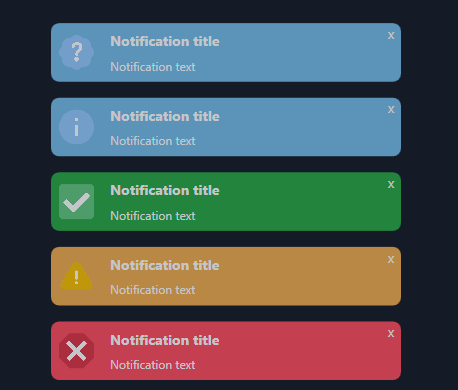

# ModernToast
Modern custom toast popups for WPF applications

## Quick Start

1. Download ModernToast from nuget.org


2. Import ModernToast in your `View.xaml`

```xaml
xmlns:Toast="clr-namespace:ModernToast.Usercontrols;assembly=ModernToast"
```


3. Create and position your popups area, where the toasts will be rendered and stacked on view

```xaml
<Toast:ToastAreaControl x:Name="ToastArea" VerticalAlignment="Bottom" HorizontalAlignment="Right" Width="500"/>
```


4. Finally, just call the desired `CreateToast` method overload from `ToastArea` inside your `View.xaml.cs`. You can choose many options like colors, sizes and duration

```c#
        private void Button_Click_1(object sender, RoutedEventArgs e)
        {
            ToastArea.CreateToast(5, "Title", "Notification text", 300);
        }
```


5. If you're using **MVVM pattern**, this can be achieved by referencing your `ToastArea` to a new `ToastAreaControl` object present in your View Model:
   
- Create a new `ToastAreaControl` property inside your View Model:
```c#
           public ToastAreaControl ToastArea { get; set; }
```

      
- In your `View.xaml.cs` during the `OnWindowLoaded` event set your  `ToastAreaControl` property as the `ToastArea` UI element:
```c#
         void OnWindowLoaded(object sender, RoutedEventArgs e)
        {
            (DataContext as ViewModel).ToastArea = ToastArea;
        }
```

- Then you can call the exact same method as before, but from your View Model and it will update the UI element on your View:
  
```c#
        private void CreateToastFromViewModel()
        {
            ToastArea.CreateToast(5, "Title", "Notification text", 300);
        }
```
This shoul be your result:



There are a many different properties that you can change to customize your toast, including:
- Background Color
- Message Color
- Duration
- Width
- Toggle Show/Hide Close (x) button
- Toggle Show/Hide Image
        
